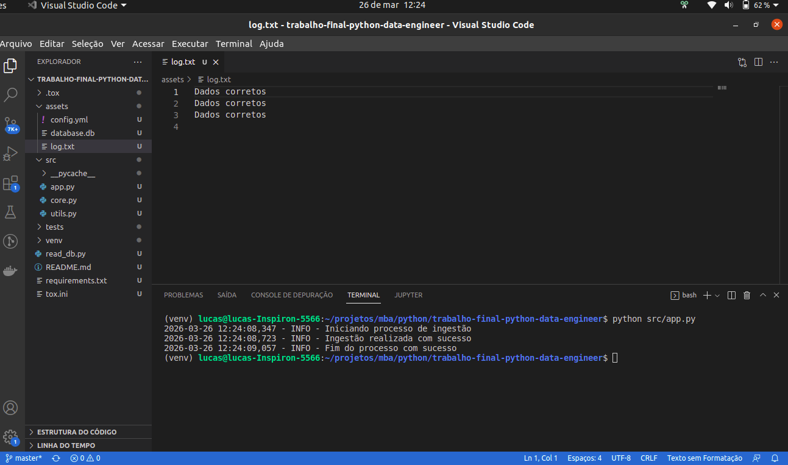
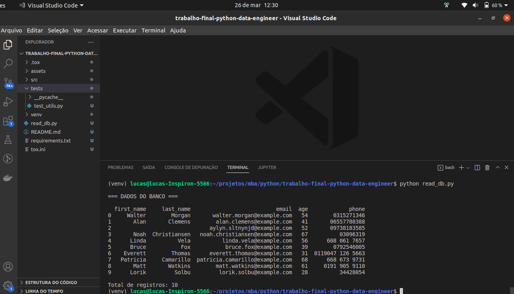
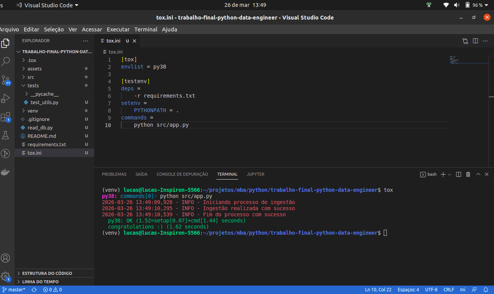

# 🚀 Projeto Data Engineering com Python

Este projeto implementa um **pipeline de dados completo** utilizando
Python, seguindo boas práticas de Engenharia de Dados.

------------------------------------------------------------------------

## 📖 Descrição

O pipeline realiza as seguintes etapas:

### 🔹 1. Ingestão

-   Consome dados da API pública: https://randomuser.me
-   Retorna dados estruturados em **DataFrame (pandas)**

### 🔹 2. Validação

-   Verifica se as colunas obrigatórias estão presentes
-   Gera logs de sucesso ou erro

### 🔹 3. Preparação

-   Renomeia colunas
-   Ajusta tipos de dados
-   Remove caracteres especiais
-   Filtra apenas colunas relevantes

### 🔹 4. Persistência

-   Salva os dados tratados em um banco **SQLite local (.db)**

------------------------------------------------------------------------

## 🏗️ Estrutura do Projeto

    trabalho-final-python-data-engineer/
    │
    ├── src/
    │   ├── app.py
    │   ├── core.py
    │   └── utils.py
    │
    ├── assets/
    │   ├── config.yml
    │   └── database.db
    │   └── log.txt
    │
    ├── tests/
    │   └── test_utils.py
    |
    ├── requirements.txt
    ├── tox.ini
    ├── read_db.py
    └── README.md

------------------------------------------------------------------------

## ⚙️ Como executar o projeto

``` bash
python -m venv venv
venv\Scripts\activate (windows) | source venv/bin/activate (linux)
pip install -r requirements.txt
python src/app.py
```

``` bash
Para executar o tox (após ativar a env do python)
pip install tox
tox
```

------------------------------------------------------------------------

## 🗄️ Banco de Dados

O projeto utiliza **SQLite**, que cria automaticamente:

    assets/database.db

------------------------------------------------------------------------

## 🔍 Visualizando os dados

``` python
python read_db.py
```

------------------------------------------------------------------------

## 🧠 Tecnologias utilizadas

-   Python (3.8.10)
-   Pandas
-   Requests
-   SQLite
-   Pydantic
-   StrictYAML
-   Pytest
-   Tox

------------------------------------------------------------------------

## 🎯 Objetivo

Demonstrar conceitos de: Pipeline de dados - API - Transformação -
Persistência - Boas práticas

------------------------------------------------------------------------

## 📋 Resultados finais






